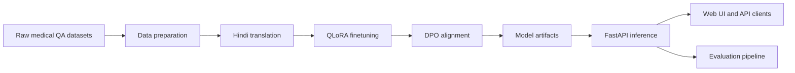

## MedQA Hindi: Multilingual Medical AI Assistant with QLoRA + DPO


MedQA Hindi is a multilingual medical QnA assistant trained with QLoRA finetuning and DPO alignment to improve factuality and safety for Hindi and English queries. It includes data preparation, training, evaluation, and a FastAPI inference service with a lightweight web UI.

Disclaimer: This system is for educational purposes only. It is not a substitute for professional medical advice, diagnosis, or treatment.

## Highlights

- QLoRA finetuning for efficient multi-GPU and single-GPU training
- DPO alignment for improved helpfulness and reduced unsafe responses
- FastAPI inference service with health checks and model comparison
- CI pipeline with API tests and evaluation metric tests

## Architecture



## Evaluation Summary

| Metric | Base | QLoRA | DPO | Improvement (DPO) |
|--------|------|-------|-----|------------------|
| BERTScore | 0.71 | 0.82 | 0.87 | +22% |
| Medical Accuracy | 0.45 | 0.72 | 0.78 | +73% |

Evaluation methodology:

- ROUGE-L: Longest common subsequence between generated and reference answers
- BERTScore: Semantic similarity using multilingual BERT embeddings
- Medical Accuracy: Keyword overlap on medications, symptoms, body parts, and treatments

## Repository Structure

```
medqa-hindi/
├── api/                    # FastAPI service and inference engine
├── data/                   # Dataset preparation and translation scripts
├── evaluation/             # Metrics and comparison tooling
├── frontend/               # Single-page UI
├── training/               # QLoRA and DPO training scripts + configs
├── tests/                  # API and evaluation tests
├── Dockerfile
├── docker-compose.yml
├── requirements.txt
└── requirements-ci.txt
```

## Quickstart

### Local development

```bash
python -m venv .venv
source .venv/bin/activate
pip install -r requirements.txt
uvicorn api.main:app --host 0.0.0.0 --port 8000
```

Open the API docs at `http://localhost:8000/docs`.

### Docker

```bash
docker build -t medqa-hindi .
docker run --gpus all -p 7860:7860 medqa-hindi
```

The container uses `start.sh` to download model artifacts and serve the API on port 7860.

### Docker Compose

```bash
docker compose up --build
```

## API Overview

Base URL: `http://localhost:7860`

- `GET /` - service metadata and endpoint list
- `GET /api/health` - health status and model load states
- `POST /api/ask` - ask a single question
- `POST /api/compare` - compare responses across models
- `GET /api/metrics` - evaluation summary

Example request:

```bash
curl -X POST http://localhost:7860/api/ask \
  -H "Content-Type: application/json" \
  -d '{"question": "बुखार के लिए क्या करें?", "model": "dpo"}'
```

## Training

### Data preparation

```bash
python data/prepare_dataset.py
python data/translation.py
python data/create_dpo_pairs.py
```

### QLoRA finetuning

```bash
python training/qlora_finetune.py --config training/configs/qlora.yaml
```

### DPO alignment

```bash
python training/dpo_align.py --config training/configs/dpo.yaml
```

## Evaluation

```bash
python evaluation/evaluate.py
python evaluation/compare_models.py
```

## Hardware Requirements

Training:

- Minimum: NVIDIA T4 16GB, 16GB RAM, 50GB disk
- Recommended: V100/A100, 32GB RAM, 100GB disk

Inference:

- Minimum: 4GB VRAM, 8GB RAM, 10GB disk

## Production Considerations

- Deployment: containerized runtime via `Dockerfile` with health checks
- Observability: use reverse proxy metrics plus FastAPI logging
- Model storage: set `QLORA_MODEL_ID` and `DPO_MODEL_ID` env vars for HF Hub downloads
- Secrets: keep tokens out of the repo; supply `HUGGINGFACE_HUB_TOKEN` via env
- Scaling: run multiple workers and place behind a load balancer
- Safety: include medical disclaimer in UI and API responses

## CI

CI runs on every push to `main` and `dev` and on PRs into `main`.

- Import checks for FastAPI schemas
- API tests with mocked inference (GPU not required)
- Evaluation metric tests

## License

MIT License. See `LICENSE` for details.

Upstream licenses:

- Qwen2.5: Tongyi Qianwen License
- MedQuAD: Public Domain
- MedMCQA: Apache 2.0
- IndicTrans2: MIT

## Acknowledgments

- Qwen Team for the base model
- Hugging Face for datasets and tooling
- AI4Bharat for IndicTrans2
- Kaggle for compute support
